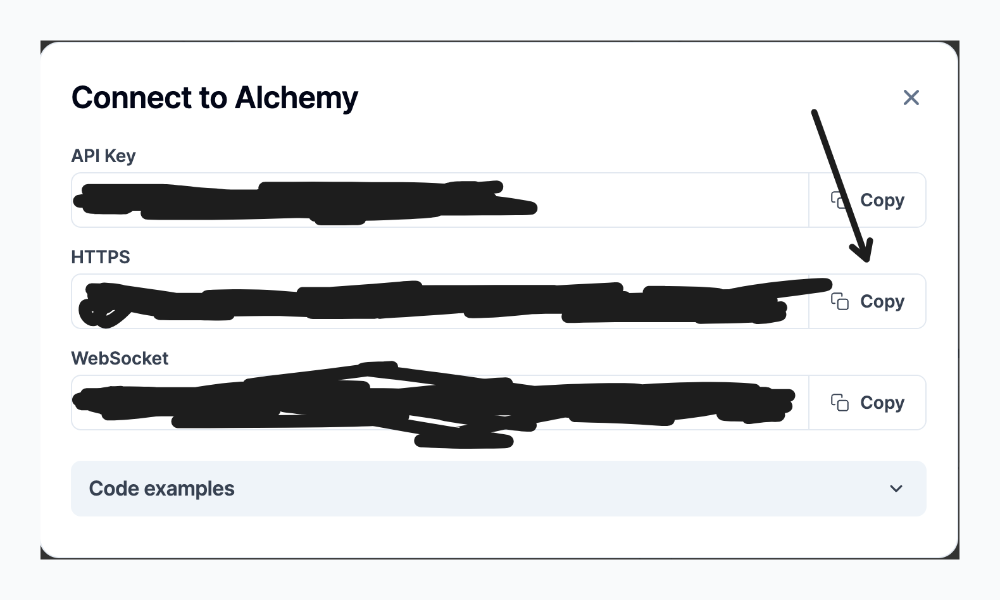

# HARDHAT PROJECT TEMPLATE: SCAFFOLDING

Since it takes a while to scaffold a new hardhat project—as we all know—I've given you this code; all you have to do is follow the instructions.

### Clone the repo and install the neccessary packages

```shell
git clone https://github.com/WebSculptor/hardhat-template
npm install
```

### Nothing has to be touched in the `hardhat.comfig.ts` file because I've already configured it. This is how it appears.

```ts
import { HardhatUserConfig } from "hardhat/config";
import "@nomicfoundation/hardhat-toolbox";
import dotenv from "dotenv";

dotenv.config();

const {
  YOUR_ALCHEMY_MAINNET_API_URL,
  YOUR_ALCHEMY_SEPOLIA_API_URL,
  YOUR_METAMASK_ACCOUNT_PRIVATE_KEY,
  YOUR_ALCHEMY_MUMBAI_API_URL,
} = process.env;

const config: HardhatUserConfig = {
  solidity: "0.8.24",
  gasReporter: {
    gasPrice: 10000000000,
  },
  networks: {
    hardhat: {
      forking: {
        url: YOUR_ALCHEMY_MAINNET_API_URL!,
      },
    },
    sepolia: {
      url: YOUR_ALCHEMY_SEPOLIA_API_URL!,
      accounts: [YOUR_METAMASK_ACCOUNT_PRIVATE_KEY!],
    },
    mumbai: {
      url: YOUR_ALCHEMY_MUMBAI_API_URL!,
      accounts: [YOUR_METAMASK_ACCOUNT_PRIVATE_KEY!],
    },
  },
};

export default config;
```

### Create a `.env` file, and insert this code into it.

```jsx
YOUR_ALCHEMY_MAINNET_API_URL = "<your-alchemy-mainnet-api-url>";
YOUR_ALCHEMY_SEPOLIA_API_URL = "<your-alchemy-sepolia-api-url>";
YOUR_METAMASK_ACCOUNT_PRIVATE_KEY = "<your-metamask-account-private-key>";
YOUR_ALCHEMY_MUMBAI_API_URL = "<your-alchemy-mumbai-api-url>";
```

### To obtain your alchemy keys, register [here](https://www.alchemy.com/) and follow the instructions.

1. Go to your dashboard and click on `view all apps`.


2. Click on create a new app.


3. Select the networks needed


4. Get your API Key for the network


5. Copy the HTTPS url and paste in your `.env`



### Navigate to the `package.json` and change this lines:

```json
{
  "name": "<your-project-name>",
  "author": "<your-name-goes-here>"
}
```

Change `<your-project-name>` to the name of your project and `<your-name-goes-here>` to your name.

### Commands to run

1. To test your contract, run this command:

```shell
npm run test
```

2. To run the hardhat node, run this command:

```shell
npm run node
```

3. To run the deploy script locally, run this command:

```shell
npm run dev
```

4. To run the deploy script to a network, run this command:

```shell
npm run prod
```

_Note: Make sure you change the `<your-network-name>` to the network you want to deploy to_ <br />
_Make sure to change the file name `scripts/deploy.ts` depending on which file you want to run_

## If theres anything you'd like to change, don't forget to contribute
